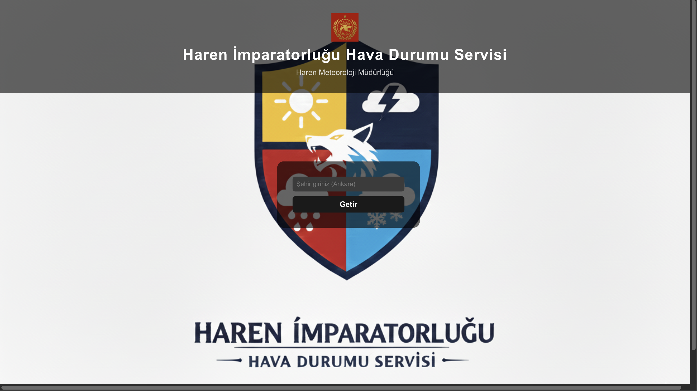

# Haren İmparatorluğu Hava Durumu Servisi

## Proje Açıklaması
Bu React uygulaması, kullanıcıdan şehir adı alarak Open-Meteo API üzerinden güncel hava durumunu getirir. Hava durumuna göre arka plan görseli değişir.

## Kullanılan API
- [Open-Meteo Geocoding API](https://open-meteo.com/en/docs/geocoding-api)
- [Open-Meteo Weather API](https://open-meteo.com/en/docs)

## Nasıl Çalıştırılır
1. Projeyi klonlayın ve dizine girin:  
   `git clone <repo-linki>`  
   `cd <proje-dizini>`

2. Bağımlılıkları yükleyin:  
   `npm install`

3. Projeyi başlatın:  
   `npm run dev`

4. Tarayıcıda `http://localhost:5173` adresine gidin.

## Ekran Görüntüleri

## Özellikler
- Kullanıcı şehir girebilir
- Hava durumuna göre arka plan değişir
- Loading ve hata mesajları
